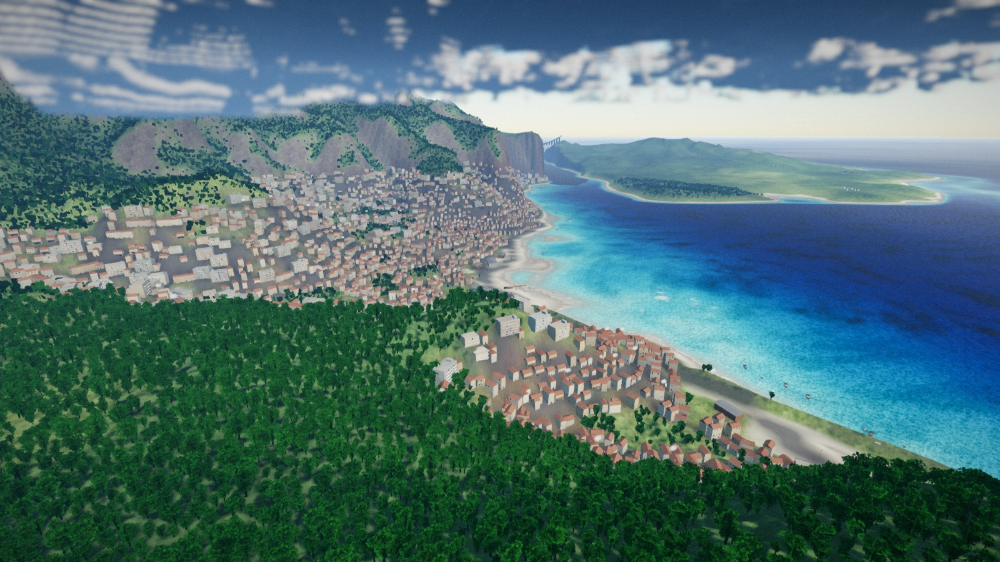
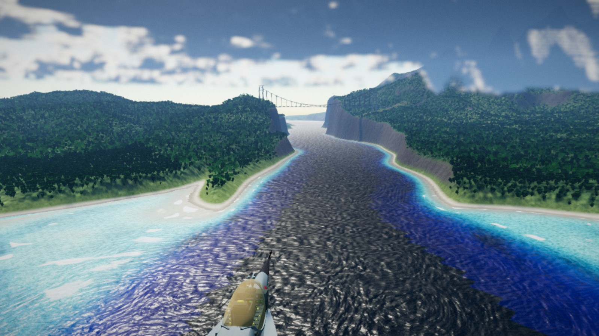
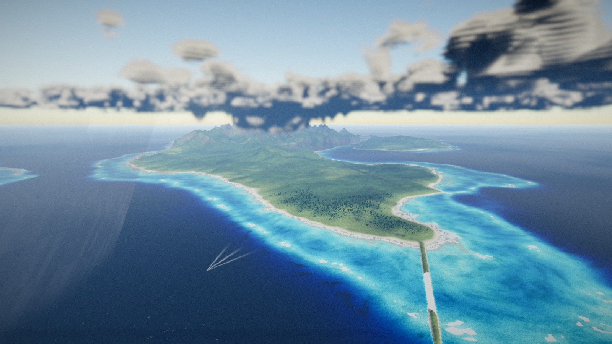
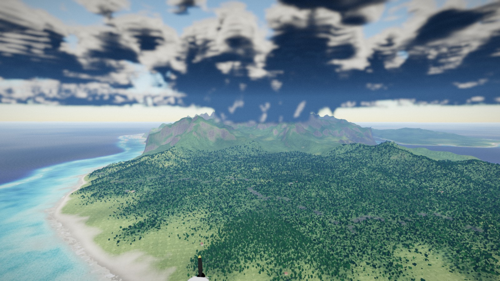
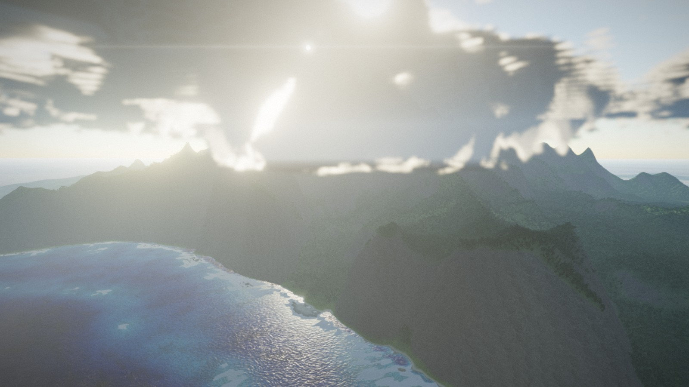
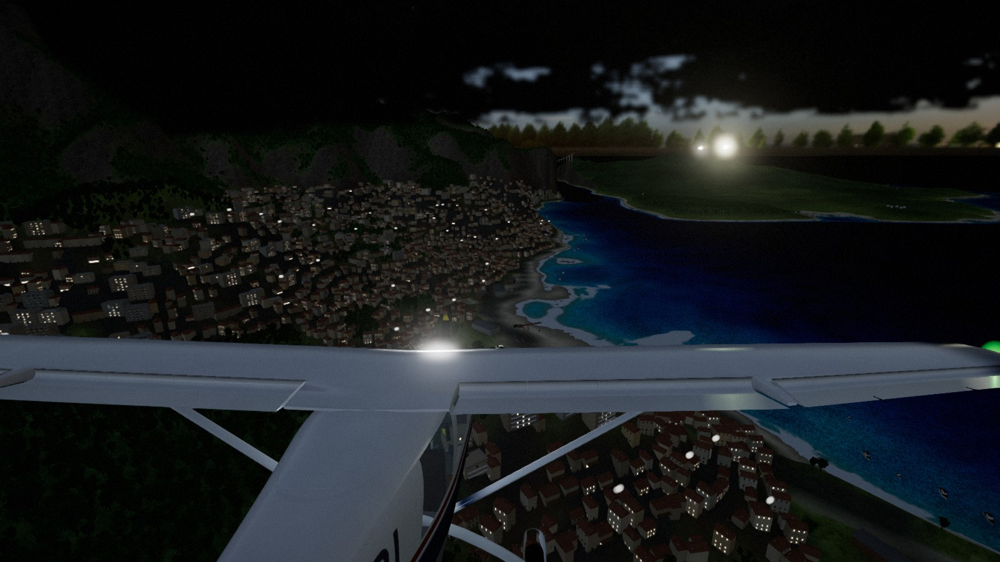

# AERIS

Mini simulateur de vol photoréaliste dans le navigateur. Deux appareils — un Cessna 172
et un MiG-29 — un archipel de vingt-cinq kilomètres avec une ville portuaire, trois
aérodromes et un détroit à passer sous un pont : décoller, voler, se poser.



## Lancer

```bash
npm install
npm run dev
```

Puis ouvrir <http://localhost:5173>. Pour un build de production :

```bash
npm run build && npm run preview
```

Le premier chargement génère le relief et lance la passe d'érosion (environ deux
secondes), puis télécharge les textures. Les suivants sont servis par le cache.

## Commandes

Un écran de choix s'affiche avant le vol. `?aircraft=mig29` le contourne.

| Action | Clavier / souris | Manette |
|---|---|---|
| Tangage (cabrer / piquer) | ↓ / ↑, ou souris après un clic droit | Stick gauche |
| Roulis | ← / → | Stick gauche |
| Lacet (palonnier) | Q / E | LB / RB |
| Gaz | Maj (plus) / Ctrl (moins) | RT / LT |
| Aérofreins · freins de roue | B | X |
| Volets | V (sortir) / F (rentrer) | Croix haut / bas |
| Train d'atterrissage | G | L3 |
| Trim | Pg↑ / Pg↓, Retour arrière pour remettre à zéro | — |
| Changer de caméra | C | Y |
| Regard libre | Clic droit maintenu + souris | Stick droit |
| Zoom | Z | — |
| **Canon** | Espace, ou clic gauche souris capturée | A |
| **Tirer l'arme sélectionnée** | Entrée | B |
| **Changer d'arme** | Tab | Croix gauche / droite |
| **Verrouiller une cible** | T, ou clic molette | R3 |
| **Leurres** | X | — |
| Aide | H ou Échap | Back |
| Pause | P | — |
| Heure du jour | Curseur en bas, ou [ et ] | — |
| Remettre sur la piste | R | Start |
| Capture d'écran | F2 | — |
| Plein écran | F11 | — |
| Masquer l'interface | I | — |
| Couper le son | M | — |

Le panneau d'aide (**H**) liste tout cela, s'adapte à la manette si elle est branchée,
et allume les touches réellement pressées : on peut essayer une commande sans le
fermer. Il s'ouvre tout seul au premier lancement, puis plus jamais.

Le son démarre au premier clic ou à la première touche, comme l'exige le navigateur.
Le freinage est passé sur **B** : sur un avion de combat, la barre d'espace est la
détente. Sur le MiG, le même levier sort l'aérofrein en vol et freine les roues au sol,
comme sur l'appareil réel.

## Les deux appareils

Ils ne se pilotent pas du tout pareil, et c'est voulu.

Le **Cessna** pèse une tonne, décolle à 55 kt, monte à 900 ft/min et se stabilise tout
seul dès qu'on lâche le manche. Il pardonne : la protection d'incidence retire
progressivement de l'autorité à cabrer près du décrochage, si bien qu'un manche tiré à
fond donne un enfoncement et non un départ en vrille.

Le **MiG-29** pèse quatorze tonnes et sort 163 kN avec les deux réchauffes allumées. La
poussée est là mais les réacteurs mettent deux secondes et demie à monter en régime,
donc il se pilote en anticipant. Il roule à 60°/s, encaisse 9 g, et l'aile continue de
porter bien au-delà de l'incidence où le Cessna aurait renoncé. En contrepartie
l'inertie est écrasante : un renversement se prépare, il ne s'improvise pas. La
stabilisation automatique est presque absente. Poussée maximale, la post-combustion
s'allume dans le dernier cran de manette, le champ de vision s'ouvre, la flamme éclaire
le fuselage et l'air derrière les tuyères se met à onduler. Au-delà de 4 g le voile gris
commence à fermer la vision périphérique.

## Repères de pilotage

L'avion est posé au seuil de piste, volets rentrés. Plein gaz, laisser accélérer,
tirer vers 55 kt, tenir 8° de cabré : il monte à 80 kt et 900 ft/min. En finale,
volets sortis, 60 kt, arrondir juste avant le contact.

Le manche au neutre stabilise doucement l'assiette et remet les ailes à plat. La
protection d'incidence retire progressivement de l'autorité à cabrer près du décrochage,
donc un manche tiré à fond mène à un enfoncement, pas à un départ en vrille.

## Arborescence

```
src/
  core/       Noise (simplex, fBm, ridged) · Input clavier/souris/manette · Engine (rendu, CSM)
  world/      Archipelago (îles, baies, chenal, lieux — arithmétique pure, exécutable sous node)
              Heightfield · Erosion hydraulique · Terrain (quadtree) · Vegetation · Foliage
              Runway (les trois aérodromes) · Settlement (rues, parcelles, port, entaille du sol)
              Life (bateaux, trafic, oiseaux, fumées, phare)
  water/      Ocean (houle, clapot, réfraction du fond, déferlement, sillages)
  sky/        Atmosphere (Rayleigh/Mie) · AerialPerspective · Environment (IBL dynamique) · CloudNoise
  aircraft/   AircraftConfig (tout ce qui distingue les deux appareils) · FlightModel
              Aircraft (animation des gouvernes, du train, des tuyères) · Cameras
              Livery (peintures procédurales : Cessna, camouflage MiG, métal thermique, verrières)
              Instruments · InstrumentsSoviet (cadrans cyrilliques) · HeadUpDisplay
  combat/     Armament (catalogue, pylônes, emports) · StoreRack (emports visibles)
              Ordnance (obus, missiles, roquettes, bombes) · Targeting (réticule, verrouillage)
              Effects (fumée, étincelles, traçantes, explosions, débris) · Targets · Enemy
  fx/         Pipeline (post-traitement complet) · Particles · Afterburner · JetEffects
              Weather (grains de pluie, tremblement de chaleur)
  audio/      Audio (piston ou turbine, vent, Doppler, réverbération, bang supersonique)
  ui/         HUD · CombatHud (réticule, verrouillage, alerte) · HelpPanel (commandes)
              TimeSlider · Selection (choix de l'appareil) · LoadoutScreen (emport)
  shaders/    atmosphere · sky · terrain · ocean · clouds · post
tools/        fetch-assets.py (télécharge et empaquette) · shrink-glb.py · blender_rpc.py
              vite-screenshot-plugin.ts (capture de référence, serveur de dev uniquement)
blender/      Scripts de modélisation du Cessna, pilotés via le serveur MCP de Blender
blender/mig/  Idem pour le MiG-29
blender/weapons/  Les dix emports, exportés en un seul stores.glb
blender/targets/  Camions, blindés, radar, cuves, patrouilleur, hangar, tour
blender/town/     Vingt-huit archétypes : maisons, immeubles, église, hangars, grues,
                  bateaux, phare, pylône et tablier de pont, voitures, réverbères, épave
tools/mapview.mjs Carte de l'archipel en deux secondes, dessinée par le code du jeu
public/       Textures CC0, HDRI, cessna.glb, town.glb
```

## Le monde

Huit îles volcaniques sur vingt-six kilomètres de côté, environ vingt-cinq du bout de
l'archipel à l'autre bout. Tout est généré, rien n'est un jeu de données réelles.

**La Grande Île** porte le pic principal (un peu plus de mille mètres), l'aérodrome
principal sur sa plaine orientale, et la ville portuaire au fond d'une baie abritée.
**Ponant** et **Levant** ont chacune un village et une piste courte. Restent l'**Îlot du
Phare**, le **Banc de l'Épave** où un caboteur s'est mis au sec, les **Aiguilles** et un
sec au sud-est.

**Le détroit** sépare la Grande Île de l'**Île du Détroit** : un chenal de trois cent
cinquante mètres entre des parois qui montent à deux cent cinquante, avec un pont
suspendu dont le tablier est à cent soixante-huit mètres. Il n'est pas là pour décorer :
il relie la haute mer à la baie du port, donc c'est le chemin court quand on rentre par
l'ouest, et on débouche au-dessus de la ville.

### La géométrie

Une île est une union de capsules en distances signées ; une baie et un chenal en sont
soustraits. La largeur de la montée côtière décide seule si le rivage est une plage ou
une falaise : c'est le même opérateur, avec quarante mètres de course au lieu de trois
cents. Les entailles sont mesurées en coordonnées monde et non dans l'espace déformé des
côtes, parce qu'une baie peut se déplacer d'un kilomètre mais pas le détroit.

L'érosion hydraulique tourne sur une copie deux fois moins fine et revient en delta : ce
qu'elle produit — réseau de drainage, fonds de vallée, cônes de déjection — se mesure en
centaines de mètres et est entièrement résolu à vingt-cinq. Les parois du détroit et les
pistes sont exclues du masque d'érosion : une goutte lâchée sur une face à quatre-vingts
degrés la ramène volontiers à son angle de repos.

Le terrain est un quadtree. Une grille uniforme assez fine pour les falaises ferait des
dizaines de milliers de tuiles ; assez grossière pour être dessinée, elle transformerait
chaque crête lointaine en mesa. Les fissures entre deux niveaux voisins sont recousues
en rabattant un sommet sur deux du bord fin sur la ligne que trace le voisin grossier —
pas de jupe, qui sur un dévers passe toujours devant la surface du voisin.

### L'eau

C'est soixante-dix pour cent de l'image, donc elle est construite comme l'eau
fonctionne. Le rayon de vue est réfracté à la surface, suivi jusqu'au fond, et ce qui
remonte est atténué par Beer-Lambert sur la distance parcourue dans l'eau. L'eau claire
absorbe le rouge vingt fois plus vite que le bleu : le sable sous un mètre reste du
sable, sous cinq mètres il est turquoise, sous trente il a disparu. Tout le dégradé de
profondeur sort de trois coefficients, et il se reteinte tout seul quand la lumière
change.

Le fond est fait de sable, de patates de corail, d'herbiers et de roche, choisis par la
profondeur et la pente, avec un réseau de caustiques qui se défocalise en descendant.

Le déferlement n'est pas une texture. Une vague casse là où le fond remonte sous elle —
la profondeur ici comparée à celle de cent trente mètres au large — et la houle réfracte
en s'échouant, donc la phase du ressac est prise sur la profondeur elle-même : les lignes
blanches suivent exactement le récif, avancent vers la côte, et tiennent en permanence
sur le tombant.

La houle est portée par la géométrie, le clapot par des normales calculées au pixel : à
quatre mètres de longueur d'onde sur des quads de vingt, une vague ne devient pas petite,
elle devient un damier aligné sur le maillage. Le chemin scintillant du soleil est un
lobe spéculaire dont la largeur croît avec l'empreinte du pixel, parce qu'un pixel de mer
lointaine contient toute une distribution de pentes.

Chaque coque laisse un sillage de Kelvin — l'eau brassée dans l'axe et les deux bras
plumeux à dix-neuf degrés et demi. L'avion aussi, sous vingt-cinq mètres.

### Ce qui est construit

Vingt-huit archétypes sortis de Blender, réutilisés trois mille fois. Chaque matériau
porte son rôle dans son nom et le moteur le lit : les murs prennent la couleur de
l'instance, les toits un tiers de cette couleur, les fenêtres s'allument au crépuscule
bâtiment par bâtiment.

Une ville de coteau n'est pas des maisons éparpillées sur une pente. Ce sont des rues qui
suivent les courbes de niveau parce qu'une rue ne grimpe pas plus vite qu'un camion, des
parcelles taillées à plat parce qu'une maison ne se pose pas sur un dévers, et une
densité qui décroît depuis l'eau — vieille ville sur le port, immeubles derrière, maisons
sur la pente, fermes au bord. Le terrain est entaillé avant d'être maillé, donc les
terrasses sont dans le sol et non cachées sous les bâtiments.

Le bâti est aussi peint dans une carte de couverture que lit le shader de terrain : une
ville vue de dix kilomètres reste une ville, grise et quadrillée, et non un flanc vert où
des maisons apparaissent quand on s'approche.

Les routes sont tracées par un routeur qui, à chaque pas, prend le cap qui se rapproche
le plus du but pour le moins de dénivelé — d'où une corniche qui longe la côte et
contourne les ravins.

### Ce qui vit

Des cargos et des chalutiers traversent entre les îles, des barques sont amarrées aux
quais, des voitures roulent sur la corniche, le phare tourne, quelques cheminées fument,
et une volée de mouettes décolle quand on passe bas.

L'air poussé le long d'un versant condense : au-dessus des hautes terres la base des
nuages descend et la couverture monte, donc les sommets portent une calotte quand la mer
autour est dégagée. Les grains sont des colonnes sombres et striées sous un nuage, vues
de l'extérieur. L'après-midi, l'air chaud au ras du sol fait trembler le bout lointain
de l'île.

Les bâtiments, les grues et le tablier du pont sont solides. Le tablier a une hauteur et
pas seulement une emprise : tout l'intérêt du détroit est de passer dessous.

## Ce qui tourne sous le capot

**Terrain.** Champ de hauteurs de 2048² sur vingt-six kilomètres, érodé par gouttes
d'eau (modèle de Beyer) sur une copie deux fois moins fine, réinjectée en delta. Rendu
par quadtree : un nœud se subdivise tant qu'il est plus près que trois fois sa largeur.

**Matière.** Quatre jeux PBR (sable, herbe, forêt, paroi) mélangés par altitude, pente et
bruit macro, la paroi en triplanaire et rejouée à plat pour l'éboulis. Les jeux ont été
photographiés en climat sec — l'herbe est kaki, la « forêt » est brune — donc chaque
couche garde sa luminance, normalisée autour de sa propre moyenne, et reçoit la couleur
que l'endroit doit avoir. Au-delà de deux kilomètres il n'y a plus d'arbres instanciés :
ce qui fait lire une canopée d'en haut n'est pas sa couleur mais son grumeau, donc un
champ à l'échelle d'une couronne devient une pente et sa propre occlusion.

Le shader de terrain est à seize échantillonneurs, ce qui est la limite. Le dix-septième
ne se plaint pas : le programme ne se lie pas et le sol devient blanc.

**Ciel.** Diffusion de Rayleigh et Mie intégrée par raymarching sur le dôme, avec un
terme de diffusion multiple qui blanchit l'horizon au lieu de le laisser virer au jaune.
Pour les surfaces, la même physique est intégrée analytiquement : c'est vingt fois moins
cher et indiscernable jusqu'à une vingtaine de kilomètres.

**Nuages.** Couche volumétrique traversable, raymarchée à la demi-résolution contre le
tampon de profondeur, avec du bruit Perlin-Worley 3D, une carte météo, un éclairage de
Beer-Powder et des rayons crépusculaires lorsqu'on les perce. Le pas de marche croît
géométriquement le long du rayon : les nuages proches, où l'œil lit la forme, sont
échantillonnés tous les trente mètres, et les échantillons grossiers sont dépensés au
loin où la perspective aérienne a déjà tout lavé. À pas constant il aurait fallu 270 m
pour atteindre l'horizon, soit un pas plus large que les cumulus eux-mêmes, et le bruit
de décorrélation censé masquer ça ressortait en damier sur toute la couche.

**Océan.** Voir « L'eau » plus haut : réfraction et extinction jusqu'au fond, houle en
géométrie et clapot au pixel, déferlement sur la remontée du fond, sillages de Kelvin,
courbure terrestre pour que la mer épouse l'horizon de l'atmosphère.

**Avion.** La cellule vient de Blender via son serveur MCP. La peinture, elle, est
procédurale et évaluée dans le repère de l'avion : bandes, immatriculation, lignes de
tôle, rivets, traînées d'échappement, crasse de ventre et usure de bord d'attaque, sans
couture d'UV ni limite de résolution. Le tableau de bord est redessiné en direct depuis
l'état de vol : les six instruments de base fonctionnent réellement.

**Vol.** Modèle six degrés de liberté en coefficients aérodynamiques classiques, piloté
par une configuration par appareil : masse, inerties, portance, traînée d'onde
transsonique, autorité des gouvernes, poussée et train rentrant. Atmosphère standard, si
bien que la densité et la vitesse du son varient avec l'altitude — ce qui donne au
chasseur sa perte de poussée en montée et son nombre de Mach. Décrochage progressif,
effet dièdre, lacet inverse, souffle hélicoïdal pour l'hélice. Une stabilisation douce
n'agit que manche au neutre, et beaucoup moins sur le chasseur.

**Effets du chasseur.** La post-combustion est dessinée en trois temps : la flamme
elle-même, avec son cœur bleu-blanc et les disques de choc régulièrement espacés ; la
lumière qu'elle projette sur la cellule et sur la piste ; et l'air qu'elle chauffe, rendu
dans un tampon dédié que la passe de composition lit comme un décalage en espace écran.
S'y ajoutent le cône de vapeur transsonique, la nappe de condensation sur l'extrados à
forte charge, les vortex de bout d'aile, les traînées de condensation en altitude et le
bang supersonique au franchissement.

**Image.** Exposition automatique pondérée au centre, ACES, occlusion ambiante en espace
écran, bloom sélectif, flou de mouvement par reprojection, profondeur de champ en
cockpit, halo d'objectif sobre, grain et vignettage. La résolution interne s'ajuste
toute seule pour tenir la cadence.

## Armement

Le Cessna reste désarmé. Le MiG-29 emporte ce que porte réellement un 9.13.

Un **écran d'emport** s'ouvre avant le vol. La silhouette n'est pas un dessin : c'est
l'avion lui-même vu de dessus, avec les vrais emports sous les vraies ailes. On glisse
une arme sur un pylône, ou on clique un des trois presets. `?aircraft=mig29` saute
l'écran et décolle avec l'emport mixte.

| Arme | Code OTAN | Rôle | Stations |
|---|---|---|---|
| GSh-30-1 | — | Canon 30 mm, 150 obus, 1500 c/min, emplanture gauche | fixe |
| R-73 | AA-11 Archer | Air-air courte portée, infrarouge, fort dépointage | 1 · 2 · 3 |
| R-27R | AA-10 Alamo | Air-air moyenne portée, guidage radar | 2 · 3 |
| R-60M | AA-8 Aphid | Air-air courte portée, léger | 1 · 2 · 3 |
| B-8M1 | 20 × S-8 | Panier de roquettes 80 mm, salve | 2 · 3 |
| UB-32 | 32 × S-5 | Panier de roquettes 57 mm | 2 · 3 |
| S-24B | — | Roquette lourde 240 mm, à l'unité | 2 · 3 |
| FAB-250 / FAB-500 | — | Bombes lisses | 2 · 3 / 3 |
| KMGU-2 | — | Distributeur de sous-munitions | 3 |

Les emports pèsent et traînent. Un MiG chargé au maximum embarque près de deux tonnes
sous les ailes et se pilote comme tel ; le même appareil après une passe est
sensiblement plus vif, et c'est la moitié de la récompense.

Cent cinquante obus font six secondes de détente pour toute la sortie : chaque rafale
compte, ce qui est exactement la contrainte que le vrai canon impose.

## Viser

Le réticule canon n'est pas une croix peinte sur la glace. C'est le point où les obus
tirés maintenant seront dans une seconde, chute et traînée comprises, calculé en
intégrant un obus virtuel contre le relief et contre les cibles. Il est juste : si le
réticule est sur le camion, la rafale touche le camion.

Le verrouillage (T ou clic molette) parcourt ce qui est devant le nez et se referme sur
une cible ; le cadre rétrécit à mesure que l'autodirecteur s'installe et le grondement
infrarouge monte en hauteur et en cadence avec la qualité de l'accroche. En dessous
d'un verrouillage solide, le missile part tout droit — ce qui est le résultat honnête.

Les chasseurs adverses larguent des leurres quand un missile les poursuit, et un leurre
fonctionne parce qu'il est ce que l'autodirecteur préfère, pas par magie. Quand l'un
d'eux tire, une voix russe synthétique annonce le départ et un liseré rouge indique la
direction.

## Cibles

Cinq installations, placées par recherche de terrain plat plutôt qu'à des coordonnées
écrites en dur — le relief est généré, une coordonnée fixe finit un jour dans la mer.

- **Convoi** : camions et transports de troupes en colonne.
- **Site radar** : cabine, antenne qui tourne à six tours par minute, deux camions.
- **Dépôt de carburant** : cinq cuves. La première qui saute emmène les autres une
  seconde plus tard, ce qui transforme cinq cibles en un événement.
- **Port** : trois patrouilleurs au mouillage dans une baie.
- **Terrain adverse** : tarmac, hangars, tour de contrôle, MiG gris au parking.

Chaque épave reste sur place, noircie, affaissée, et brûle une bonne minute avec une
colonne de fumée noire visible de plusieurs kilomètres.

Trois chasseurs adverses patrouillent, en gris uni sans marquages. Leur pilotage est
volontairement simple et volontairement lisible : croisière, virage, dégagement en
montée, et break avec leurres. Un adversaire dont on devine le prochain mouvement une
seconde à l'avance est bien plus amusant à poursuivre qu'un adversaire savant.

## Les effets

**Canon.** Chaque obus est un vrai projectile : dispersion en cône, chute, une traçante
sur cinq. Les traçantes ont un plancher de largeur en pixels, parce qu'un obus de trente
millimètres à un kilomètre couvre un quart de pixel et n'apparaîtrait jamais autrement —
les vraies traçantes se voient parce qu'elles sont petites et violemment lumineuses, ce
qu'un moteur ne peut reproduire qu'en leur donnant un plancher à l'écran. Le recul
freine réellement l'avion et secoue la cellule ; les douilles tombent et rebondissent.

**Missiles.** L'arme se détache, chute une fraction de seconde, puis le moteur s'allume :
c'est cette demi-seconde qui rend un tir lisible. Le guidage est une navigation
proportionnelle — la même que celle des vrais autodirecteurs — qui produit la courbe
d'interception, et les gouvernes suivent la commande. La fumée est posée au mètre
parcouru le long du trajet et non à la frame : à trois cents mètres par seconde, une
bouffée par image laisse cinq mètres de vide et se lit comme un chapelet de boules.

**Salve.** Les roquettes partent décalées de cinquante-cinq millisecondes, en éventail,
et la fumée d'allumage engloutit l'avion pendant une seconde.

**Explosions.** En couches, dans l'ordre où l'œil les lit : le flash, la boule de feu
qui bout, l'onde de choc, la distorsion de chaleur écrite dans le même tampon que celle
des tuyères, les débris projetés, et la colonne qui reste. Le son arrive séparément :
il est programmé avec le temps de trajet réel, si bien qu'une cuve qui saute à deux
kilomètres éclaire d'abord et arrive six secondes plus tard. C'est le détail le plus
convaincant de tout le mixage.


## Images


*Le détroit, en approche par l'ouest : trois cent cinquante mètres d'eau entre deux
parois, et le pont suspendu au fond.*


*La ville au fond de sa baie, les quartiers qui montent le coteau, le pont au loin.*


*Ponant depuis le nord-est : platier corallien, tombant, sillage d'un caboteur.*


*Le nuage se forme sur le pic pendant que la mer autour reste dégagée.*


*Contre-jour du matin sur la crête ouest.*


*Les fenêtres se sont allumées une par une, les réverbères suivent les rues.*


*MiG-29 plein réchauffe au-dessus de l'archipel, caméra cinématique.*


*Livrée camouflage bicolore, étoiles rouges, numéro de bord 042, train sorti.*


*Planche de bord soviétique, cadrans cyrilliques, collimateur tête haute.*


*Cessna 172 au seuil de piste, lumière du matin.*


*Dépôt de carburant après la passe : cuves noircies, colonnes de fumée, débris.*


*Passe canon sur le convoi, emport mixte sous les ailes.*

## Limites connues

- L'intérieur du cockpit du MiG est le point faible du projet : la géométrie est
  correcte et les instruments fonctionnent, mais la matière et les détails de cabine ne
  sont pas au niveau du reste. La symbologie du collimateur est lisible mais mal centrée
  sur la glace.
- Les vortex de bout d'aile sont rendus en sprites ; ils se lisent comme un filet de
  vapeur, pas encore comme le cordon torsadé du phénomène réel. Un ruban géométrique
  suivant la trajectoire du saumon serait la bonne primitive.
- Les cadences en images par seconde n'ont toujours pas été mesurées dans un onglet
  visible. Le monde a été instrumenté à 1600 × 900 (autour de 8 ms par image au-dessus
  de la ville) et à 1920 × 1080, mais les mesures en onglet masqué dérivent d'un facteur
  deux entre deux séries : elles ne valent rien en absolu. Le brief demandait 60 images
  par seconde en survol du centre-ville et je ne peux pas certifier ce chiffre ici. La
  mise à l'échelle adaptative de la résolution interne est là pour ça, et le budget
  géométrique est petit — le coût est dans les pixels, pas dans les triangles.
- Les véhicules et les bâtiments sont construits pour la silhouette, à la distance d'une
  passe de mitraillage ou d'un survol à trois cents pieds. De près, ils ne tiennent pas
  la comparaison avec la cellule.
- Le brief demandait des imposteurs entre un et quatre kilomètres. Ils ne sont pas là :
  les vingt-huit archétypes totalisent quatre mille polygones, si bien que trois mille
  instances coûtent moins cher en géométrie qu'une passe de rendu d'atlas d'imposteurs
  en coûterait à charger. La géométrie va donc jusqu'à trois kilomètres quatre, où elle
  est repliée sur son origine dans le vertex shader, et au-delà c'est la carte de
  couverture peinte dans le terrain qui tient le rôle.
- Le tunnel annoncé dans le brief n'est pas creusé. Le portail est modélisé, mais le
  routeur de routes ne sait pas encore décider qu'il vaut mieux traverser une crête que
  la contourner.
- Les rues de la ville sont dessinées et les bâtiments s'alignent dessus, mais il n'y a
  pas de plan : deux terrasses voisines ne sont reliées par aucun escalier.
- Les chasseurs adverses ne se servent que du missile. Ils n'ont pas de canon, et ils ne
  cherchent jamais à se placer derrière : ils fuient, virent et se défendent.


## Assets

Textures et HDRI : [Poly Haven](https://polyhaven.com), licence CC0. `tools/fetch-assets.py`
télécharge uniquement ce qui sert et empaquette les jeux du terrain deux fichiers par
couche (albédo × occlusion, normale + rugosité dans l'alpha), ce qui tient sous la limite
de 16 échantillonneurs du GPU. La cellule de l'avion est modélisée pour ce projet ;
`tools/shrink-glb.py` recompresse les textures embarquées dans le glTF.

Le dossier `blender/` ne garde que les scripts de modélisation. Le `.blend`, le cache de
bake et les rendus de référence en sont dérivés et restent hors du dépôt.
