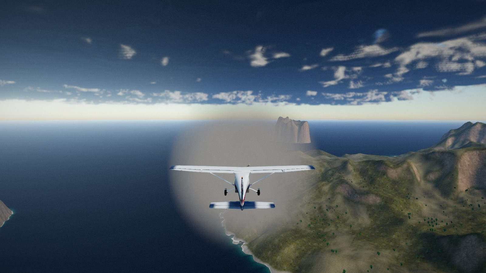

# AERIS

Mini simulateur de vol photoréaliste dans le navigateur. Un monomoteur type Cessna 172,
un archipel d'environ 10 km², une piste : décoller, voler, se poser.



## Lancer

```bash
npm install
npm run dev
```

Puis ouvrir <http://localhost:5173>. Pour un build de production :

```bash
npm run build && npm run preview
```

Le premier chargement génère le relief et lance la passe d'érosion (environ deux
secondes), puis télécharge les textures. Les suivants sont servis par le cache.

## Commandes

| Action | Clavier / souris | Manette |
|---|---|---|
| Tangage (cabrer / piquer) | ↓ / ↑, ou souris après un clic droit | Stick gauche |
| Roulis | ← / → | Stick gauche |
| Lacet (palonnier) | Q / E | Gâchettes LT / RT |
| Gaz | Maj (plus) / Ctrl (moins), molette | Stick droit haut / bas, ou A / B |
| Volets | V (sortir) / F (rentrer) | Croix haut / bas |
| Freins | Espace | X |
| Changer de caméra | C | Y |
| Caméra libre : orbite et zoom | Clic gauche glissé, molette | Stick droit |
| Heure du jour | Curseur en bas, ou [ et ] | LB / RB |
| Remettre sur la piste | R | Start |
| Pause | P ou Échap | Select |
| Masquer l'ATH | H | — |
| Couper le son | M | — |

Le son démarre au premier clic ou à la première touche, comme l'exige le navigateur.

## Repères de pilotage

L'avion est posé au seuil de piste, volets rentrés. Plein gaz, laisser accélérer,
tirer vers 55 kt, tenir 8° de cabré : il monte à 80 kt et 900 ft/min. En finale,
volets sortis, 60 kt, arrondir juste avant le contact.

Le manche au neutre stabilise doucement l'assiette et remet les ailes à plat. La
protection d'incidence retire progressivement de l'autorité à cabrer près du décrochage,
donc un manche tiré à fond mène à un enfoncement, pas à un départ en vrille.

## Arborescence

```
src/
  core/       Noise (simplex, fBm, ridged) · Input clavier/souris/manette · Engine (rendu, CSM)
  world/      Heightfield · Erosion hydraulique · Terrain (chunks LOD) · Vegetation · Foliage · Runway
  water/      Ocean (Gerstner, écume, profondeur)
  sky/        Atmosphere (Rayleigh/Mie) · AerialPerspective · Environment (IBL dynamique) · CloudNoise
  aircraft/   FlightModel · Aircraft (animation) · Livery (peinture procédurale) · Instruments · Cameras
  fx/         Pipeline (post-traitement complet) · Particles
  audio/      Audio (moteur, vent, Doppler, réverbération)
  ui/         HUD · TimeSlider
  shaders/    atmosphere · sky · terrain · ocean · clouds · post
tools/        fetch-assets.py (télécharge et empaquette) · shrink-glb.py · blender_rpc.py
              vite-screenshot-plugin.ts (capture de référence, serveur de dev uniquement)
blender/      Scripts de modélisation de l'avion, pilotés via le serveur MCP de Blender
public/       Textures CC0, HDRI, cessna.glb
```

## Ce qui tourne sous le capot

**Terrain.** Un champ de hauteurs de 1024² est généré à partir de masques d'îles
déformés, de massifs à basse fréquence et de bruit ridgé, puis érodé par 156 000
gouttes d'eau (modèle de Beyer). C'est l'érosion qui donne les vallées, les lignes de
crête et les cônes de déjection ; sans elle le bruit seul reste une hérissure. Le rendu
est découpé en tuiles à cinq niveaux de détail, dont les bords sont calés sur une grille
commune : les fissures entre niveaux disparaissent sans jupe.

**Matière.** Cinq jeux PBR (sable, herbe, forêt, éboulis, paroi) mélangés par altitude,
pente et bruit macro, la paroi en triplanaire. Chaque jeu est échantillonné deux fois
avec des rotations différentes et mélangé par un bruit lent : la grille de répétition
disparaît sans le coût d'un pavage stochastique.

**Ciel.** Diffusion de Rayleigh et Mie intégrée par raymarching sur le dôme, avec un
terme de diffusion multiple qui blanchit l'horizon au lieu de le laisser virer au jaune.
Pour les surfaces, la même physique est intégrée analytiquement : c'est vingt fois moins
cher et indiscernable jusqu'à une vingtaine de kilomètres.

**Nuages.** Couche volumétrique traversable, raymarchée au quart de résolution contre le
tampon de profondeur, avec du bruit Perlin-Worley 3D, une carte météo, un éclairage de
Beer-Powder et des rayons crépusculaires lorsqu'on les perce.

**Océan.** Six vagues de Gerstner en espace monde, normales de détail défilantes, écume
de crête et de rivage calculée depuis la profondeur d'eau, courbure terrestre pour que
la mer épouse l'horizon de l'atmosphère.

**Avion.** La cellule vient de Blender via son serveur MCP. La peinture, elle, est
procédurale et évaluée dans le repère de l'avion : bandes, immatriculation, lignes de
tôle, rivets, traînées d'échappement, crasse de ventre et usure de bord d'attaque, sans
couture d'UV ni limite de résolution. Le tableau de bord est redessiné en direct depuis
l'état de vol : les six instruments de base fonctionnent réellement.

**Vol.** Modèle six degrés de liberté en coefficients aérodynamiques classiques, avec
décrochage progressif, effet dièdre, lacet inverse et souffle hélicoïdal. Une
stabilisation douce n'agit que manche au neutre.

**Image.** Exposition automatique pondérée au centre, ACES, occlusion ambiante en espace
écran, bloom sélectif, flou de mouvement par reprojection, profondeur de champ en
cockpit, halo d'objectif sobre, grain et vignettage. La résolution interne s'ajuste
toute seule pour tenir la cadence.

## Assets

Textures et HDRI : [Poly Haven](https://polyhaven.com), licence CC0. `tools/fetch-assets.py`
télécharge uniquement ce qui sert et empaquette les jeux du terrain deux fichiers par
couche (albédo × occlusion, normale + rugosité dans l'alpha), ce qui tient sous la limite
de 16 échantillonneurs du GPU. La cellule de l'avion est modélisée pour ce projet ;
`tools/shrink-glb.py` recompresse les textures embarquées dans le glTF.

Le dossier `blender/` ne garde que les scripts de modélisation. Le `.blend`, le cache de
bake et les rendus de référence en sont dérivés et restent hors du dépôt.
